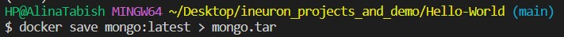

## Docker commands
### 1. docker images
``` 
List out all the images
```

### 2. docker pull ```<imagename>```
``` 
Pull the imagename from the Docker Hub
```

### 3. docker run -d -p5000:5000 ```<imagename>```
``` 
Run the image locally in detach mode by binding the container port with the host port number.
```

### 4. docker ps
``` 
List out all the running containers 
```

### 5. docker ps -a
``` 
List out all the running or no running containers 
```

### 6. docker rmi -f ```<imagename>```
``` 
Remove the image forcefully locally 
```

### 7. docker build -t ```<imagename>```:```<tagname>``` .
``` 
Build the image 
```

### 8. docker stop ```<containerid>```
``` 
It will stop the running container 
```

### 9. docker start ```<containerid>```
``` 
It will start the stopped container 
```

### 10. docker logs ```<containerid>```
``` 
It will provide the log details of the container 
```

### 11. docker run -d -p5000:5000 --name ```<newimagename>``` ```<oldimagename>```
``` 
Run the image locally in detach mode by binding the container port with the host port number and changes the default name of the container
```

### 12. docker exec -it ```<containerid>``` //bin//bash
``` 
This command enter into the image and can see the log files or environment variables associated. 
```

### 13. docker network ls
``` 
List out all the docker networks 
```


### 14. docker network create ```<networkname>```
``` 
It will create a docker network. 
```

### 15. docker rm ```<containerid>```
``` 
It will remove the container from the local. 
```

### 16. docker port ```<containerid>```
``` 
It will port on which image running. 
```

### 17. docker inspect ```<containerid>```
``` 
It will provide detailed info about the container. 
```

### 18. docker save ```<image-name>``` > ```<tarfilename>```
``` 
It will save the image in a tar file. 
```

### 19. docker image prune -a
``` 
It will delete all unused images. 
```

### 20. docker rename ```<old-name>``` ```<new-name>```
``` 
It will rename the conatiner. 
```

### 21. docker load -i ```<tar-file>```
``` 
It will load the docker image from the tar file. 
```


